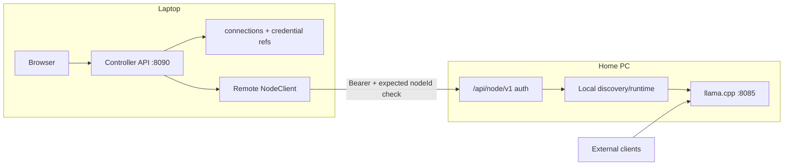

# Phase 16 MVP Implementation Plan

**Status:** Implementation plan (not yet implemented).  
**Scope choice:** MVP slice — Controller-only + one remote Node for status, discovery, and router start/stop/restart.  
**Out of MVP:** jobs, full GPU/process monitoring UI, log SSE, model/build switch, preset generation from Controller, Local Node dual-role, multi-Node scheduling, OS credential manager, product TLS/PKI.

This plan follows project-plan §16.7 but truncates to a shippable first slice. Later slices reuse the same contracts.

## Goal

A laptop ObsidianLM **Controller** configures one Home PC **Node**, authenticates, and mediates typed status / discovery / router lifecycle operations. The browser talks only to the laptop backend. Inference clients continue direct `:8085/v1` to the Node. Standalone same-host behavior remains unchanged.

```text
Browser → Laptop Controller :8090 → authenticated Node API → Home PC Node
                                                      ↓
                                         models / builds / router :8085
OpenCode / clients ───────────────────────────────────► Home PC :8085/v1
```

## Locked decisions (MVP)

| Open item | MVP decision |
|-----------|--------------|
| Deployment modes | `standalone` (default), `controller`, `node`. No Local Node dual-role. |
| Node identity | Opaque stable `node_<id>` in Node-local `node-identity.json`. Independent of hostname/IP/display name/endpoint. |
| Node API shape | Versioned `/api/node/v1/*` only for remote Controllers. Existing `/api/*` stays same-host Standalone/Node-local UI. |
| Pairing | Node shows one-time pairing code/secret; Controller completes pair; Node issues long-lived bearer token bound to that Controller connection. |
| Reconnect trust | Before using saved credential, Controller calls unauthenticated-or-bootstrap `info` and requires `nodeId === expectedNodeId`. Mismatch → block privileged ops; require re-pair. |
| Credentials | Controller stores secrets in separate `controller-credentials.json` (not settings/domain/exports). File-backed MVP; structure allows later Windows Credential Manager. |
| Connections | `controller-connections.json`: display name, endpoint, expectedNodeId, protocolVersion, capability snapshot, active selection, credential **reference** id. |
| Optimistic concurrency | MVP config writes are minimal. Discovery/runtime ops do not rewrite domain revision from Controller. If a later write lands, use Node `revision` / If-Match style on mutating Node config APIs. |
| Compatibility | Handshake returns `protocolVersion` + `capabilities[]`. Unsupported actions disabled in UI; no dangerous fallback. |
| Local/Remote boundary | Conceptual `NodeClient` with Local (in-process) and Remote (HTTP) adapters sharing one typed operation set. |
| Transport | Document Tailscale (or equivalent overlay) + app auth, or HTTPS + app auth. No Tailscale APIs. No product PKI. |
| Auth on Node public `/api/*` | Unchanged for same-host. Remote privilege requires `/api/node/v1/*` + bearer. Do not reintroduce Phase 9 global admin token on all `/api/*` in MVP. |

## Non-goals (explicit)

- Inference proxy through Controller  
- SSH/SCP/SMB as control or discovery transport  
- Arbitrary remote command API  
- Auto model/dataset copy  
- Controller disconnect stopping Node runtime  
- Destructive remote uninstall/reset on connection remove  
- Jobs, bench/perplexity, full telemetry pages, runtime log SSE  
- `switch-model` / `switch-build` / preset generate from Controller  
- Optional Local Node on the Controller host  

## Architecture



### Role behavior

- **standalone:** today’s behavior. Local NodeClient only. No remote connection store required. No Controller-only startup restrictions.
- **controller:** browser → local backend only. Startup must **not** scan model/build folders, inspect GPUs/processes, claim `:8085`, or start a local router. Mediates selected remote Node.
- **node:** owns machine resources; exposes `/api/node/v1/*` for Controllers; may still serve local UI/`/api/*` for on-box admin.

## Typed Node operations (MVP)

Shared operation set (names illustrative; freeze in `packages/shared`):

| Operation | Node route (MVP) | Notes |
|-----------|------------------|-------|
| `getInfo` | `GET /api/node/v1/info` | nodeId, displayName, protocolVersion, capabilities, platform hints |
| `pair` | `POST /api/node/v1/pair` | one-time secret → token + nodeId |
| `getStatus` | `GET /api/node/v1/status` | reuse/adapt `StatusResponse` + nodeId owner labels |
| `listModels` / `rescanModels` | discovery models | Node-local roots only |
| `listBuilds` / `rescanBuilds` | discovery llama-builds | |
| `listToolInputs` | discovery tool-inputs | read-only list ok |
| `getRuntime` | `GET /api/node/v1/runtime` | `RouterRuntimeState` |
| `startRuntime` / `stopRuntime` / `restartRuntime` | POST runtime lifecycle | typed bodies only |

All Node responses that carry resources must include `owner: { scope: "node", nodeId }` (or equivalent) so Controllers never treat locators as local.

Reject anything outside this set (no shell, no generic proxy of arbitrary `/api/*`).

## Controller API (MVP)

Browser-facing (localhost Controller backend):

| Route family | Purpose |
|--------------|---------|
| `GET/POST/PATCH/DELETE /api/controller/connections` | CRUD connection records (no raw secrets in responses) |
| `POST /api/controller/connections/:id/pair` | Complete pairing against endpoint + one-time secret |
| `POST /api/controller/connections/:id/select` | Set active Node |
| `GET /api/controller/active/*` | Mediated status/discovery/runtime for active Node |
| `POST /api/controller/active/runtime/{start,stop,restart}` | Lifecycle mediation |

Controller mediation responsibilities: timeouts, identity check before credential use, error translation (`offline`, `identity_mismatch`, `auth_required`, `capability_limited`), never apply local FS/PID/GPU assumptions to remote payloads.

## Persistence

**Node**

- `node-identity.json` — `{ nodeId, createdAt, displayName? }`
- Pairing state / token hashes — separate protected store (not domain, not exports). Prefer hash-at-rest (scrypt or equivalent), never return raw token after issuance.
- Existing `phase15-domain.json`, discovery folders, `router-runtime-state.json` remain Node-authoritative.

**Controller**

- `controller-connections.json` — known Nodes, endpoints, expectedNodeId, activeId, capability cache, credentialRef
- `controller-credentials.json` — secret material keyed by credentialRef; never logged; strip from any export path
- UI prefs may live in settings or a small controller prefs file; keep separate from Node machine config

## UI (MVP minimum)

Per DESIGN.md §10.8, only what the slice needs:

1. **Shell:** persistent Active Node indicator (`Offline` / `Online` / `Identity mismatch` / …).
2. **Settings → Nodes (or Connections):** add/edit endpoint, display name, pair, remove (non-destructive copy), select active.
3. **Dashboard / Runtime / Discovery (or Models/Builds read paths):** when role is Controller, load via `/api/controller/active/*`; show Node-scoped path labels; disable unsupported actions.
4. Offline: show last-known with clear labeling; disable start/stop/restart until live state returns.
5. Destructive copy names the Node (`Stop router on Home PC`).

Do not redesign the whole operator visual language.

## Work sequence (Builder-style runs)

### Run 1 — Ownership and identity contract

- Shared types: `NodeId`, connection record (no secrets), capability enum, protocol version constant, error codes.
- Document owner-scope rules: Controllers display remote locators; never pass them into local spawn/FS/GPU helpers.
- Extend `ResourceOwner` usage guidance; keep Standalone writing `scope: "local"` until/unless Node role rewrites to `node`.
- Tests: schema/fixtures only; no network.

**Exit:** shared contracts + unit tests; docs snippet in this file confirmed against code names.

### Run 2 — Handshake, pairing, auth

- Node: generate/persist `nodeId`; pairing secret UX (CLI print or System page one-time code); issue bearer token; hash storage.
- `GET /api/node/v1/info` (limited) + authenticated info.
- Reconnect: expected nodeId gate before privileged calls.
- Tests: pair success, wrong secret, identity mismatch blocks, token not echoed in logs/responses.

**Exit:** Node can be paired from a test client; mismatch safe.

### Run 3 — Node service boundary (typed ops)

- Implement MVP `/api/node/v1/*` handlers by delegating to existing local discovery/status/runtime modules.
- Capability advertisement lists only implemented ops.
- Reject unknown routes / methods clearly.
- Tests: auth required; start/stop/restart; discovery rescan stays Node-local.

**Exit:** authenticated HTTP client can drive status/discovery/runtime on a Node role instance.

### Run 4 — Local adapter + role startup

- `NodeClient` Local adapter wraps in-process calls (Standalone continues to use existing `/api/*` without forced HTTP loopback).
- Role flag/setting: `standalone` | `controller` | `node` (env and/or settings; exact key chosen in run).
- Controller startup: skip local discovery/GPU/router side effects.
- Tests: Standalone regression (existing phase15 tests still pass); Controller boot does not touch local model folders / port claim.

**Exit:** roles behave; Standalone semantics preserved.

### Run 5 — Remote adapter + Controller mediation

- Remote NodeClient: HTTP to `/api/node/v1`, timeouts, identity precheck, credential injection.
- Controller connection store + credential store + browser APIs above.
- Remove connection deletes Controller records/credentials only.
- Tests: mediation happy path against mock/fake Node; offline errors; remove is non-destructive.

**Exit:** browser→Controller→fake/real Node path works without browser talking to Node.

### Run 6 — Node-aware UI (MVP)

- Active Node chrome; Connections UI; wire Dashboard/Runtime/Discovery reads and runtime start/stop/restart through Controller active APIs when `controller`.
- Capability-disabled controls with reasons.
- Path labels include Node context.
- Smoke: web unit/component or Playwright smoke against Controller + stub Node if available.

**Exit:** operator can pair, select, view status/discovery, start/stop router on remote Node from UI.

### Run 7 — Deferred (post-MVP slices; not this plan’s delivery)

- Jobs + Node/build/model/dataset labels  
- GPU/process monitoring, logs SSE, bounded history  
- switch-model / switch-build / preset generate  
- Config mutation + revision conflicts  
- Optional Local Node dual-role  
- OS credential manager  

### Run 8 — Real deployment validation (MVP subset)

Validate on laptop Controller + Home PC Node (Tailscale or HTTPS):

- Pair and reconnect with stable nodeId  
- Identity mismatch blocks privileged use  
- Discovery without mounts/SMB  
- Start/stop/restart router on Node; disconnect leaves router running  
- External client still hits Node `:8085/v1`  
- Connection remove does not alter Node  
- Auth rejection and offline/last-known labeling  

Record results under `docs/validation/phase16-mvp-runN.md` (generic placeholders, no secrets).

## Verification gates

Per run: targeted unit/integration tests in `apps/service` and shared package; no long-lived `npm run dev` as verification.

Controller/Node smoke (when needed): temporary background service processes on disposable `.tmp/` data dirs and non-default ports; poll health; always tear down process trees.

Standalone regression: existing Phase 15 service tests remain green after Runs 3–5.

## Security checklist (MVP)

- Bearer tokens never in normal API JSON after pair response, presets, logs, jobs, telemetry, exports  
- Endpoints displayable to authorized Controller UI only; not in unauthenticated public diagnostics  
- Credential file separate from `phase15-domain.json` / settings  
- No arbitrary command endpoint  
- Plain HTTP only on localhost or encrypted overlay; document HTTPS requirement otherwise  

## Doc updates when implementing

- [`docs/ObsidianLM_Project_Plan.md`](ObsidianLM_Project_Plan.md) — Phase 16 status → MVP in progress / complete as runs land  
- [`README.md`](../README.md) — Controller/Node MVP setup (no secrets)  
- This file — mark runs done; link validation notes  
- [`DESIGN.md`](../DESIGN.md) — only if MVP UI names diverge from §10.8 intent  

## Suggested first commit message (when coding starts)

`docs(phase16): add MVP controller-node implementation plan`

## Success criteria (MVP done)

- Controller-only laptop manages one paired Home PC Node for status, discovery, and router start/stop/restart  
- Stable node identity + mismatch safety + non-destructive remove  
- Browser never calls Node directly  
- Standalone unchanged for same-host users  
- Real-deployment MVP checklist recorded  
- Jobs/monitoring/switch/preset/Local-Node explicitly still future  
